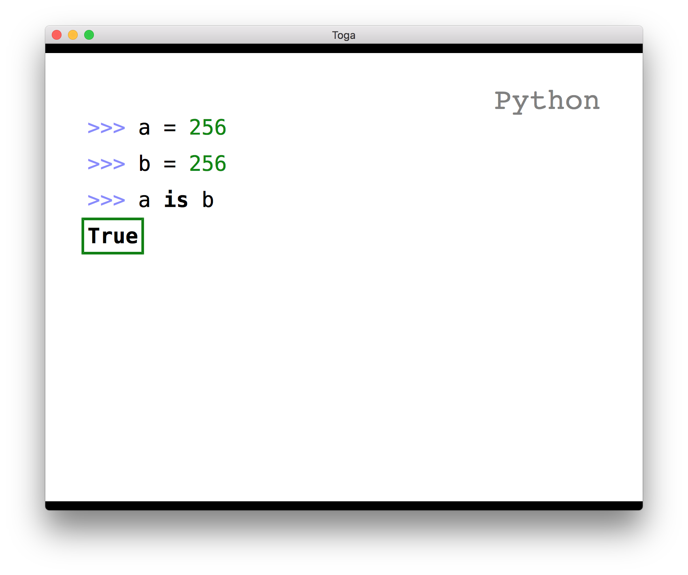

# A slightly better toolchain for quicker formatting of podium markdown files

`ruby preparse.rb input_file output_file`

## Requires - Podium

https://github.com/pybee/podium

## Tool Chain

 * Make a markdown file, e.g. `myslides.md`
 * Use these fancy shortcuts to extend the default functionality of the markdown format
 * run `ruby preparse.rb myslides.md`
  * defaults to standard out, or to the specifed file

## Shortcuts

This is just a subset of helpers

### Helpful headers `$$#`

As an example `$$#` automatically renderes to `.righthead[]`, which then links to the `.righthead` css style. 

Helpful reminder, you can chain remark.js css defines by nesting, e.g.: `.styleone[.styletwo[word] .stylethree[another]]`

### Center `=`

If your default is `center: false`, then this adds `.slide: class="center"`

### Top `#`

If not using center, this automatically adds `margin-bottom` padding as to attempt to make your sides not rise like a hot-air balloon to the top of your deck

### Code Segments

Podium uses https://highlightjs.org/static/demo/, but the markdown is.. annoying verbose

```
```python
print("Python Code %s" % "here")
```

vs

```
py print("Python Code %s" % "here")
```

Using `py-` creates a fragment (click to show)

Assumes you never use default paragraphs in your slides. (I don't. 🤷‍♀️)

Supports inline formatting

```
py >>> print(".bold[this is important]")
```

## When in doubt

Just default to useful Remark.js stuff https://github.com/gnab/remark


## Tips

Use [inotifyrun](http://exyr.org/2011/inotify-run/) to automatically run the parser whenever you update your slide file

`~/talks/mytalk $ inotifyrun ruby ~/git/adamant-capsicum/preparse.rb myslides.txt slides.md`


## Samples

* `sample_input.md`
* `sample_output.md`
* `sample_rendered.png`




# Usefulness

YMMV

# License

See [LICENSE](blob/master/LICENSE)

