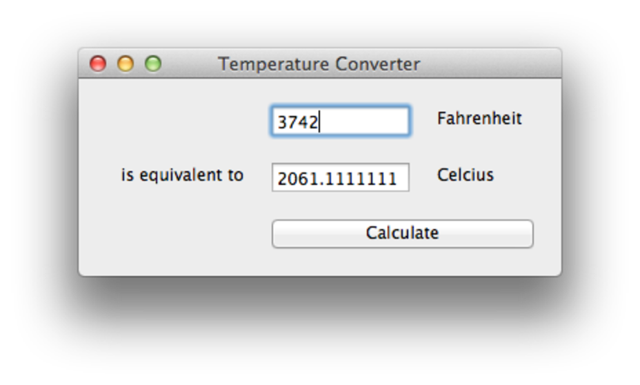

class: title

# Title Slide
## Author name

???

These are the speakers notes. They let the speaker know what they need to know. All work an no play makes jack a dull boy.

All work an no play makes jack a dull boy. All work an no play makes jack a dull boy. All work an no play makes jack a dull boy. All work an no play makes jack a dull boy. All work an no play makes jack a dull boy.

---

class: title

# This is a very long
# title slide with lots
# of text on it
## First Author name
## Second Author name
## Third Author name

---

# Title & Bullets

* Introduction
  - Subpoint
  - Subpoint
    + Subpoint
    + Subpoint
* Deep-dive
* Deep-dive
* ...

---

# Title & Numbers

1. Introduction
   1. Subpoint
   1. Subpoint
      1. Subpoint
      1. Subpoint
2. Deep-dive
3. Deep-dive
4. ...

---

# Title & Bullets (2 col)

.left-column[

* Introduction with some very long text indeed
* Deep-dive
* Deep-dive
* Deep-dive
* ...

]
.right-column[

* Introduction with some very long text indeed
* Deep-dive
* Deep-dive
* Deep-dive
* ...
]

---


.footnotes[
commons.wikimedia.org/wiki/File:Red_Kitten_01.jpg
]

---
class: screenshot



# A screenshot

---
class: logo


---
# Quotation

> One thing was certain, that the white kitten had had nothing
> to do with it -- it was the black kitten's fault entirely. For
> the white kitten had been having its face washed by the old cat,
> for the last quarter of an hour (and bearing it pretty well,
> considering) so you see that it couldn't have had any hand in
> the mischief.

<cite>Lewis Carroll, Through the Looking Glass</cite>

---

# Code sample

```python
def greeting(arg):
    if arg == 'hello':
        print 'Hello World'
    else:
        print arg


class Something(object):
    def __init__(self, *args, **kwargs):
        super(Something, self).__init__(*args, **kwargs)

```

---

# Footnotes

* First thing.dag1[]

* Second thing.dag2[]

* Third thing.dag3[]

* Last thing.dag4[]


.footnotes[
.dag1[] This isn't exactly what it sounds like. You need to consider this very carefully. And I mean _really_ carefully

.dag2[] Second dagger

.dag3[] Third dagger

.dag4[] Fourth dagger
]

---

# Formatting

* Something that is *important*

* Something that is **Really important**

I am a very modern Major-General. I've information animal and mineral and vegetable. This text should run into multiple lines.

It will then start a new paragraph.

* And then go back into bullets.

* A [link to somewhere else](http://pybee.org)

---

# Code in bullets

* Code that is `inline` with a bullet.

* Code in a bullet:

  ```python
  def greeting(arg):
      if arg == 'hello':
          print 'Hello World'
  ```
---
# Other inline content

* A quote in a bullet

    > To be, or not to be

    <cite>William Shakespeare</cite>

---
class: title reverse

# Point of emphasis
